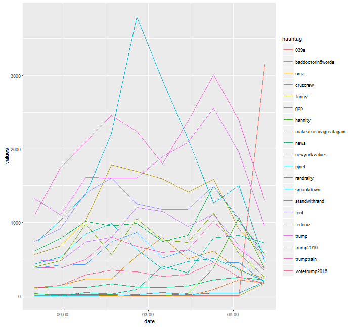
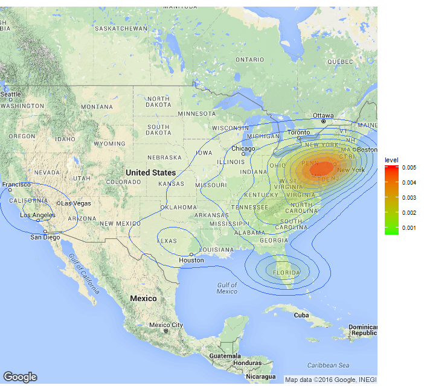

## Introduction

We are happy to introduce our new package TwitteR2Mongo connecting the Twitter API to the MongoDB using R. To ease storing and processing of large ammonuts of tweets we use the MongoDB to store the tweets in different collections. Using this package it is possible to find the most common hashtags based on your personal network i.e. the people you follow on twitter. These hashtags can be used to track the topics and trends relevant in your personal network.

The package accesses two different types of API 

- The REST API to pull the hometimeline of the user
- The Streaming API to filter all tweets posted on twitter on relevant keywords

The relevant keywords for the Streaming API are gererated using the information from the hometimeline so all tweets with content relevant to the network observed are stored. These keywords are updated dynamically when new tweets appear on the hometimeline. Alternatively you can specify a query for the Twitter Streaming API and stream those. 


## Getting Started

To use this package a working mongoDB installation is required. You can start the MongoDB server by running:

```
mongod
```

If it is the first time you start the MongoDB server you need to create a writeable directory `C:/data/db` (Windows). For a local MongoDB installation the following information should be sufficient.

```r
# Load the package
library(TwitteR2Mongo)
# Specify the two collections to use for storing the tweets
setMongoDbCredentials(type = "hometimeline", collection = "hometimeline", db = "twitter", 
url = "mongodb://localhost")
setMongoDbCredentials(type = "filterstream", collection = "filterstream", db = "twitter", 
url = "mongodb://localhost")

# Check the connection
hometimeline <- connect2MongoDb("hometimeline")
filterstream <- connect2MongoDb("filterstream")

```

Additionally you need a Twitter Account. Using this account you can register a Twitter App at:  [Twitter Application Management](https://apps.twitter.com/) and get your Consumer Key (API Key) and Consumer Secret (API Secret). Make sure to set the Callback URL to: `http://127.0.0.1:1410`. 

To connect to the Twitter-API first set your credentials using: 

```r
setAPICredentials(key = "your-API-KEY", secret = "your-API-SECRET")
makeOAuth()
```

Please use the option to store the oAuth in a file(`.httr-oauth`) as the Streaming will not work without it.

## The Hometimeline

The hometimeline contains up to 800 tweets posted by users you follow. Depending on how many users you
are currently following, you should think about updating your hometimelime regularly.

```r
# Create a connection to the collection holding the hometimeline
hometimeline <- connect2MongoDb("hometimeline")

# Retrive the most recent tweets via updateHometimeline()
updateHometimeline()

```


getInterval() returns a unixtimestamp interval. Use Sys.setlocale("LC_TIME","English"), because Twitter provides a timestamp (later the "created _at" field) which needs an English environment to be properly parsed. For details see ?as.POSIXct. If no parameters have been passed on, the function returns an interval corresponding to the last hour. If you want to have an interval which is equivalent to the last 24 hours use getInterval(60*24) (i.e. 60minutes * 24 hours). Additionally you can pass on a vector of date times via inputinterval as shown in the example below. Refrain from using the times 00:00:00 and 12:00:00. They won't be parsed. Use 00:00:01 etc. instead. When working with the twitter API you should keep in mind, that the dates provided are always in GMT. 

```r
#Set digits to 13 in order see the exact unixtimestamp in ms
options( digits = 13)

#interval of the last hour
getInterval()

#interval of the last 24 hours
getInterval(60*24) 

#specified interval
timeframe <- c("2016-01-04 18:37:43 CET","2016-01-05 18:37:43 CET")
getInterval(inputinterval = timeframe)

```


Use topHashtagsInInterval() to extract the Top hashtags from your database.
Get the Top 10 hastags in your network within the last 24 hours.
If you want to access the tweets provided by the Streaming API, just
substitute "hometimeline" by "filterstream" in order to access the other collection.

```r
topHashtagsInInterval(hometimeline, interval = getInterval(60*24), 10)

topHashtagsInInterval(hometimeline, interval = getInterval(inputinterval = timeframe), 10)

```


## The Streaming Process

The Top hastags are used to filter all tweets on twitter for relevant hashtags. To get these tweets we need to connect to the streaming API. Once started the package will continue to download and import tweets until it is stopped. The streaming process will be started in an additional R process, which handels the streaming process on its own and allows you to keep on working in your current one. The timeout indicates after how many seconds the process is restarted with updated filter parameters. Don't use too low values, otherwise you might be blacklisted by Twitter. You may also stream tweets independent from your hometimeline. You can specify various search queries as shown below. The streaming process can only be stopped by `stopStreaming()`. If a timeout occurs, then the process is not restared with new filter parameters but terminated. The higher the timeout is the longer the maximum waiting time for the process to terminate.
WARNING: The stream may create tens of GB per day and consume a lot of working memory. Execept for testing it is recommended to run it on a seperate computer. Additionally it should have an SSD and you should think about indexing your data. For further information on indexes and why they might be helpful visit: https://docs.mongodb.org/manual/indexes/ .

```r
# Start the streaming process
startStreaming(timeout = 300)

#Start the streaming process with a specified query_url
startStreaming(60,"https://stream.twitter.com/1.1/statuses/filter.json?track=Trump")

#Get a random sample of all tweets
startStreaming(60,"https://stream.twitter.com/1.1/statuses/sample.json")

# Stop the streaming process
stopStreaming()
```


## Illustrate the most important topics in your hometimeline


Extract all hashtags from your mongoDB which have been posted in the time interval specified in createIntervalVector. CreateIntervalVector takes two date time strings in the following format "2016-01-14 23:00:01" or "2016-01-15 08:00:01". You may also use the TwitterAPI format, for example "Thu Jan 15 13:38:00 +0000 2016". It then calculates a time interval specified by the second parameter in the function and returns the corresponding unix timestamps. The example below creates an interval from the 14th of January 23:00:00 to the 15th of January 08:00:00, in hourly steps.

```r
createIntervalVector(c("2016-01-14 23:00:01", "2016-01-15 08:00:01"),9)

# Which corresponds to:
 "2016-01-14 23:00:01 CET" "2016-01-15 00:00:01 CET"
 "2016-01-15 01:00:01 CET" "2016-01-15 02:00:01 CET"
 "2016-01-15 03:00:01 CET" "2016-01-15 04:00:01 CET"
 "2016-01-15 05:00:01 CET" "2016-01-15 06:00:01 CET"
 "2016-01-15 07:00:01 CET" "2016-01-15 08:00:01 CET"

```

CreateTwitterTimeseries then queries the mongoDB and extracts all hashtags from the respective time intervals and constructs a data frame. ( Again a warning, if the amount of data is very large, this may take some time.) Additionally rare tweets whose sum during the time interval are below a certain threshold are being removed from the data frame. Afterwards the data frame is being ordered in decreasing fashion with respect to the last column. Then using plotTweets() plots the top x hashtags with respect to the last time interval. The function creates a timeseries via stacking the data frame and converting it into a vectorized representation, and then uses ggplot2 to plot. 


```r
timeseries <- createTwitterTimeSeries(filterstream, c("2016-01-14 23:00:01", "2016-01-15 08:00:01"),10)
interval <- createIntervalVector(c("2016-01-14 23:00:01", "2016-01-15 08:00:01"),10)
print(plotTweets(timeseries[2:nrow(timeseries),], 20, interval))

```



rankTweets

If you want to get a ranked representation of your data frame you can use 
rankTweets. This presentation ranks your tweets in the respective intervals, which may help to identify if a hashtag has become trending.

```r
rankmoving <- rankTweets(timeseries)
head(rankmoving, n = 10)
```


absoluteHashtagCounts

If you want to sum up the counts of the respective intervals use absoluteHashtagCounts().

```r
counts <- absoluteHashtagCount(timeseries)

```

## BuildRegexQuery


The buildRegexQuery function builds a JSON string which allows you to search the mongo fields „entities.hashtags.text“ and „text“ for certain hashtags or words, in a given timeframe you might be interested in. Parameters you can pass on are the regular expression, a timestamp which defines your time interval (you can use getInterval() for that), the fields to be searched, the regex options supported by mongoDB and a conjunction.

The example below builds a JSON string which looks for the hashtag #Trump in the timeframe 2016-01-15 03:00:01 to 2016-01-15 04:00:01, in the fields “entitites.hashtags.text” and “text”. The conjunction $or ensures that only one of the used regular expressions needs to be found in a tweet in order for the tweet to be returned (In this case we are only looking for one, but you can extend that to many regular expressions). Using the conjunction $and results in returned tweets which have all regular expressions in common. A couple of parameters have a standard input, see ?buildRegexQuery() for more details.

```r
interval <- getInterval( inputinterval =  c("2016-01-15 03:00:01", "2016-01-15 04:00:01"))
query <- buildRegexQuery(c("Trump"), timestamp = interval)

```

Now using filterstream$find(query, fields), returns a data frame with tweets containing one of the regular expression hits and the three mongo fields “text”, “entitites.hashtags.text” and “created_at” specified by getMongoFields().  Note: Refrain from using regular expressions with the characters \, [ and ] since these characters are being replaced during the JSON string building process, thus falsifying your regex. Alternatively you can use a dummy like "regextobereplaced" and replace that dummy with a complicated regex after you have used buildRegexQuery(). 

```r
fields <- getMongoFields(c("text","entitites.hashtags.text","created_at"))

data <- filterstream$find(query, fields)
```


## Tweets on a density map

You can add the coordinates of the tweets to a density map. This function will only extract the
exact coordinates stored in the geo information of the tweet.

```r
data <- extractCoordinates("filterstream", "Trump", 1600)
```
One can augment the number of geotagged tweets by using the user-location field. This textfiled is
converted to lon/lat coordinates using the Google API.

To avoid a cluster of tweets in the "center" of the country one should remove the tweets only containing the name of the country

```r
data <- data[data$user$location != "USA", ]
data <- data[data$user$location != "United States", ]
data <- data[data$user$location != "United States of America", ]

result <- geocodeDataFrame(data)

drawMap(data = result, location = "USA", zoom = 4, fill = TRUE)

```



## Logfiles

The Streaming process creates two logfiles, as the seperate R instances can not print information to the console. They might be helpful in case something goes wrong with the streaming and updating process.
The logfiles will be stored in your working directory.
